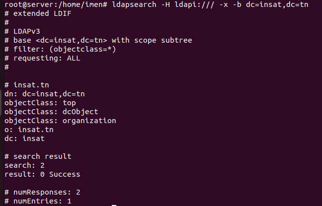

## Section 1:

### 1.0.1 Installations et configurations nécessaires:


### 1.0.2 Vérification de la configuration initiale: 

```
root@server:~# slapcat
```


```
root@server:~# ldapsearch -H ldapi:/// -x -b dc=insat,dc=tn
```

### 1.1.1 Configurez un serveur OpenLDAP avec deux utilisateurs et deux groupes:

Le fichier **`add_content.ldif`** est un fichier LDIF (LDAP Data Interchange Format) qui est utilisé pour ajouter des données à un serveur LDAP, tel qu'OpenLDAP. Dans le contexte de la configuration d'un serveur OpenLDAP avec deux utilisateurs et deux groupes, ce fichier contiendra des entrées LDIF décrivant ces utilisateurs et groupes.

Contenu du fichier **add_content.ldif :**

> [!NOTE]  
> Cependant, le simple fait de créer et d'éditer le fichier LDIF ne suffit pas à les intégrer dans le serveur LDAP. Nous allons utiliser la commande ldapadd pour importer ces données dans le serveur LDAP. La commande ldapadd prend en entrée un fichier LDIF et l'ajoute au serveur LDAP.


Nous pouvons vérifier les entrées comme suit:


Nous avons changé les mots de passe de nos 2 utilisateurs:


